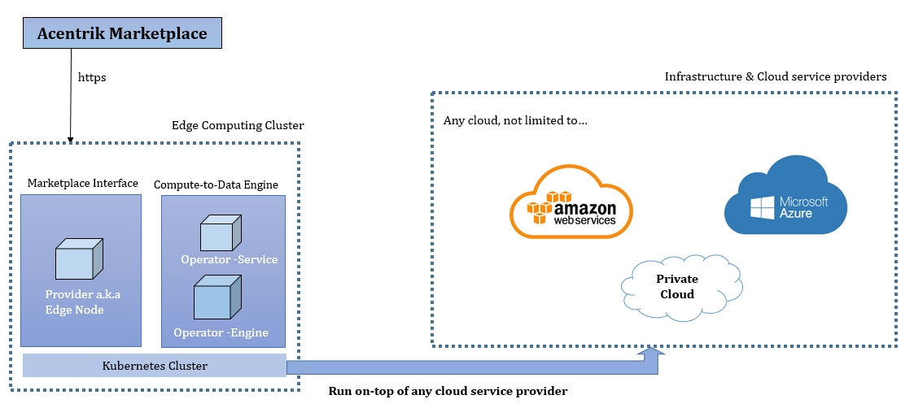

# Edge Node Cluster Guidelines and Setup Instructions

- [Overview](#overview)
- [Prerequisites](#prerequisites)
- [Tools](#tools)
- [Installation](#installation)
  - [Container Registry](#container-registry)
  - [Customize Provider Deployment](#customize-your-provider-deployment)
  - [Customize Operator-Service Deployment](#customize-your-operator-service-deployment)
  - [Customize Operator-Engine Deployment](#customize-your-operator-engine-deployment)
- [Post Installation](#post-installation)
- [Best Practice](#best-practice)

---

## Overview

An edge node cluster contains 3 major components: Provider, Operator-Service and Operator-Engine



---

## Prerequisites

First, the following resources are required for a proper runtime environment setup:

1. Own-managed Storage (either one below), for secure storage of the compute output file. (You can read more about setting up IPFS cluster on kubernetes [here](https://ipfscluster.io/documentation/guides/k8s/))
   - AWS S3 bucket
   - Public IPFS gateway
   - Private IPFS gateway
2. Own-managed PostgreSQL database (recommended stable version of Release 12.6 and above)

   Manual database creation is required before helm installation

3. An Ether wallet (MetaMask) account for the Provider and Compute-to-Data (C2D) engine (You can read more about setting up a Metamask Wallet [here](https://support.acentrik.io/help/en-us/8-starter-kit/914-wallet-set-up-metamask-reference))
4. An Ethereum RPC service provider account which supported Polygon network (such as Infura, Chainstack, Alchemy)
5. Own-managed Kubernetes environment (Eg: EKS for AWS, AKS for Azure, GKE for GCP)
6. Redis for stateless provider setup to support High Availability (Optional)
7. **Outbound network** required on the kubernetes setup, this is because provider are required to request endpoint from Acentrik services, such as Aquarius & RBAC
   - Refer to config such as `config.aquariusUrl` & `config.rbacUrl` on the values file
8. (Optional) **Inbound network** required for provider, In order for the Edge Node to connect to Acentrik Marketplace, Provider need to be **public accesible** from Acentrik Marketplace.

---

## Tools

1. Helm 3 CLI - [install](https://helm.sh/docs/intro/install/)
   - Helm CLI are for helm chart installation, Edge Node Cluster will be deploying with Helm Chart
2. Kubectl CLI - [install](https://kubernetes.io/docs/tasks/tools/#kubectl)
   - Kubectl CLI are use to run commands against Kubernetes cluster
3. curl CLI - [install](https://curl.se/download.html)
   - curl is used in command lines or scripts to transfer data. Will be running a curl command to call the initialization REST API for operator-api service

---

## Installation

Deploy the following helm chart with appropriate customized values. The download links for each helm charts will be provided.

|     | Helm Chart                                         | Recommended Namespace          | Description                                                                         |
| :-- | :------------------------------------------------- | :----------------------------- | ----------------------------------------------------------------------------------- |
| 1   | [provider](./provider)                             | network specific, e.g. polygon | An Ethereum network-specific deployment object to serve an interface to Marketplace |
| 2   | [operator-api](./operator-api)                     | ocean-operator                 | An Ethereum network-independent deployment object to manage all C2D requests        |
| 3   | [ocean-compute-operator](./ocean-compute-operator) | ocean-compute                  | An Ethereum network-independent deployment object to execute the actual C2D jobs    |

Note: Modify the helm charts according on your own Kubernetes cluster setup when necessary. Alternatively you can deploy the standard Kubernetes objects by creating your own deployment yaml files.

<br />

### Container registry

By default, all helm charts are predefined with public docker images available in Acentrik's Amazon Elastic Container Registry (Amazon ECR), as following public registry

```
public.ecr.aws/acentrik
```

Optionally you can pull and mirror all the required images to your own private registry if necessary.

<br />

### [Customize your Provider deployment](./provider)

| Variable                          | Description                                                                                                                                                     |
| --------------------------------- | --------------------------------------------------------------------------------------------------------------------------------------------------------------- |
| secret.infuraProjectId            | Ethereum RPC Project ID                                                                                                                                         |
| secret.providerPrivateKey\*       | Private key of your provider wallet account, which used to encrypt the data asset endpoint                                                                      |
| secret.networkUrl                 | Network name: polygon                                                                                                                                           |
| secret.redisConnection\*\*        | Connection URL to Redis. Defaults to None (no Redis connection, SQLite database embedded with provider is used instead)                                         |
| config.ipfsGateway                | Your IPFS Gateway if any                                                                                                                                        |
| config.operatorServiceUrl         | Your custom operator service endpoint URL (Leave the value empty if no need to run compute job)                                                                 |
| config.aquariusUrl\*\*\*          | Predefined Aquarius URL of multi-chain network. Defaults to Acentrik Aquarius URL                                                                               |
| config.authorizedDecrypters\*\*\* | List of authorized addresses that are allowed to decrypt chain data. Use it to restrict access only to certain callers (e.g. Acentrik Aquarius wallet address). |
| config.rbacUrl\*\*\*              | URL to the RBAC permissions server. Defaults to Acentrik RBAC Server                                                                                            |
| config.log.level                  | Logging level                                                                                                                                                   |
| config.allowNonPublicIp           | Allow Non Public IP to access from Provider                                                                                                                     |
| config.providerFeeToken\*\*\*     | the address of ERC20 token used to get fees, or string containing a dict of chain_id to token address pairs                                                     |

\*Provider Private Key

- The secret hash of your Ether wallet account
- A string of 64 hexadecimal characters
- Private key is unique to each wallet account
- Example: afdfd9c3d2095ef696594f6cedcae59e72dcd697e2a7521b1578140422a4f890
- As standard, the key will be stored as Kubernetes Secret. However, it is possible to integrate with an external secret provider depends on your distributed architecture infrastructure setup

\*\* Redis acting as a shared cache storage is highly recommended to support multi-replicas setup of provider service which ensure high availability. Without Redis, only 1 replica is supported.

\*\*\* For config value such as `aquariusUrl` , `authorizedDecrypters` , `rbacUrl` & `providerFeeToken`. Please request from the Acentrik team, the values will likely be dependent on which network the Edge node will be running in and which Acentrik enviroment the Edge Node will be connecting to.

For example, it'll be running Polygon Network & connecting to Acentrik Production Enviroment.

#### Steps

Copy and modify the default helm values file as a new custom-values.yaml

There's a helm values file for each network (Eg: values-polygon.yaml)

```
helm upgrade provider ./provider \
    --install \
    --namespace polygon \
    -f ./provider/custom-values.yaml \
    --debug \
    --render-subchart-notes
```

<br />

### [Customize your Operator-Service deployment](./operator-api)

| Variable                            | Description                                                                                                       |
| ----------------------------------- | ----------------------------------------------------------------------------------------------------------------- |
| secret.postgres.db                  | PostgreSQL operator database name                                                                                 |
| secret.postgres.user                | PostgreSQL operator database username                                                                             |
| secret.postgres.password            | PostgreSQL operator database password                                                                             |
| secret.postgres.host                | PostgreSQL operator database hostname                                                                             |
| secret.postgres.port                | PostgreSQL operator database port                                                                                 |
| config.operatorAddress              | Public address of your provider wallet account                                                                    |
| config.algoPodTimeout               | Allowed time (in seconds) for an algorithm to run. After timeout, the relevant execution pods will be terminated. |
| config.signatureRequired            | 0 -> no signature required, 1 -> request brizo signature                                                          |
| config.allowedProviders             | Json array with allowed providers that can access the endpoints                                                   |
| config.defaultNamespace             | namespace which will run the jobs                                                                                 |
| config.resource.inputVolumeSize     | Compute engine container input file volume size, value should include unit.                                       |
| config.resource.outputVolumeSize    | Compute engine container output file volume size, value should include unit.                                      |
| config.resource.adminLogsVolumeSize | Compute engine container log file volume size, value should include unit.                                         |
| config.resource.requestsCpu         | Compute engine container request minimum CPU, value should include unit.                                          |
| config.resource.requestsMemory      | Compute engine container request minimum memory, value should include unit.                                       |
| config.resource.limitsCpu           | Compute engine container request maximum CPU, value should include unit.                                          |
| config.resource.limitsMemory        | Compute engine container request maximum memory, value should include unit.                                       |

#### Steps

Copy and modify the default helm values file as a new custom-values.yaml

```
helm upgrade operator-api ./operator-api \
    --install \
    --namespace ocean-operator \
    -f ./operator-api/custom-values.yaml \
    --debug \
    --render-subchart-notes
```

<br />

### [Customize your Operator-Engine deployment](./ocean-compute-operator)

| Variable                          | Description                                                                                                 |
| --------------------------------- | ----------------------------------------------------------------------------------------------------------- |
| secret.postgres.db                | PostgreSQL operator database name                                                                           |
| secret.postgres.user              | PostgreSQL operator database username                                                                       |
| secret.postgres.password          | PostgreSQL operator database password                                                                       |
| secret.postgres.host              | PostgreSQL operator database hostname                                                                       |
| secret.postgres.port              | PostgreSQL operator database port                                                                           |
| secret.operatorPrivateKey         | Private key of your operator wallet account                                                                 |
| config.aws.enabled                | Allowed AWS S3 bucket for compute data storage                                                              |
| secret.aws.accessKeyId            | AWS IAM user account access key ID to access S3 bucket                                                      |
| secret.aws.secretAccessKey        | AWS IAM user account access secret key to access S3 bucket                                                  |
| config.aws.bucket.output          | S3 bucket to store compute output files                                                                     |
| config.aws.bucket.adminlogs       | S3 bucket to store compute log files                                                                        |
| config.ipfs.enabled               | Allowed IPFS for compute data storage. Note: By enable ipfs, it will always override AWS S3 storage option. |
| config.ipfs.output                | IPFS API endpoint to store compute output files                                                             |
| config.ipfs.adminlogs             | IPFS API endpoint to store compute log files                                                                |
| config.ipfs.outputPrefix          | IPFS API endpoint for end-user to download compute output files                                             |
| config.ipfs.adminlogsPrefix       | IPFS API endpoint for end-user to download compute log files                                                |
| config.ipfs.expiryTime            | IPFS ExpiryTime                                                                                             |
| config.storageClass               | Storage class to use                                                                                        |
| config.pod.configurationContainer | Configuration Container Image                                                                               |
| config.pod.publishContainer       | Publish Container Image                                                                                     |
| config.log.level                  | Logging Level                                                                                               |
| config.debug.noCleanup            | Clean Up after Compute job finished                                                                         |
| config.serviceAccount             | K8 service account to run pods. Defaults to 'default'                                                       |
| secret.ipfs.apiKey\*              | IPFS API Key for authentication purpose (optional)                                                          |
| secret.ipfs.apiClient\*           | IPFS API Client ID for authentication purpose (optional)                                                    |

\*\* Dedicated API Client ID and Key will be distributed for usage of Acentrik's Decentralized Storage

#### Steps

Copy and modify the default helm values file as a new custom-values.yaml

```
helm upgrade ocean-compute-operator ./ocean-compute-operator \
    --install \
    --namespace ocean-compute \
    -f ./ocean-compute-operator/custom-values.yaml \
    --debug \
    --render-subchart-notes
```

---

## Post-installation

### Initialize database

The newly created edge node Cluster must be initialized after the installation completed.

Assuming your Operator-Service (operator-api) is running on namespace 'ocean-operator' with port 8050, perform the following actions.

Check if operator service are running as expected, expected to see the pod are running with status 1/1

```
kubectl get pods -n ocean-operator
```

Portfoward to the running operator-api service

```
kubectl port-forward service/operator-api 8050:8050 -n ocean-operator
```

Run a curl command to call the initialization REST API

```
curl -X POST "http://localhost:8050/api/v1/operator/pgsqlinit" -H "accept: application/json"
```

<br />

---

<br />

## S3 As Edge Node Cluster Storage

### If you're choosing s3 bucket to store the compute outputs

First of all here's the IAM policy required to attached to the user

```
{
    "Version": "2012-10-17",
    "Statement": [
        {
            "Sid": "VisualEditor0",
            "Effect": "Allow",
            "Action": [
                "s3:PutObject",
                "s3:GetObjectAcl"
            ],
            "Resource": [
                "arn:aws:s3:::[bucket-outputs]/*",
                "arn:aws:s3:::[bucket-logs]/*"
            ]
        }
    ]
}
```

For the S3 buckets permission, you could just set it to public accessible (with Bucket ACL - Read access) or restricted to accessible only from your VPC

To restricted it so it can only accessible from your VPC

- You need to create an S3 endpoint for the cluster VPC (VPCE)
- You need your VPC public IP Address (NAT Gateways)

Setup the bucket policy (Added a section for your AWS user so you can update the policy in the future)

```
{
    "Version": "2012-10-17",
    "Statement": [
        {
            "Effect": "Allow",
            "Principal": {
                "AWS": "arn:aws:iam::38194819XXX:user/XXXX"
            },
            "Action": [
                "s3:PutObject",
                "s3:GetObjectAcl",
                "s3:GetObject",
                "s3:PutObjectAcl"
            ],
            "Resource": [
                "arn:aws:s3:::[bucket-outputs]/*",
                "arn:aws:s3:::[bucket-logs]/*"
            ]
        },
        {
            "Effect": "Allow",
            "Principal": "*",
            "Action": [
                "s3:PutObject",
                "s3:GetObjectAcl",
                "s3:GetObject",
                "s3:PutObjectAcl"
            ],
            "Resource": [
                "arn:aws:s3:::[bucket-outputs]/*",
                "arn:aws:s3:::[bucket-logs]/*"
            ],
            "Condition": {
                "IpAddress": {
                    "aws:SourceIp": [
                        "13.213.214.0/24"
                    ]
                }
            }
        },
        {
            "Effect": "Allow",
            "Principal": "*",
            "Action": [
                "s3:PutObject",
                "s3:GetObjectAcl",
                "s3:GetObject",
                "s3:PutObjectAcl"
            ],
            "Resource": [
                "arn:aws:s3:::[bucket-outputs]/*",
                "arn:aws:s3:::[bucket-logs]/*"
            ],
            "Condition": {
                "StringEquals": {
                    "aws:sourceVpce": "vpce-07c64XXXXXXXXX"
                }
            }
        }
    ]
}
```

With this policy, you can block all public access on your S3 buckets.

<br />

---

<br />

## Best Practice

For more information, refer to: https://support.acentrik.io/help/en-us/10/10
