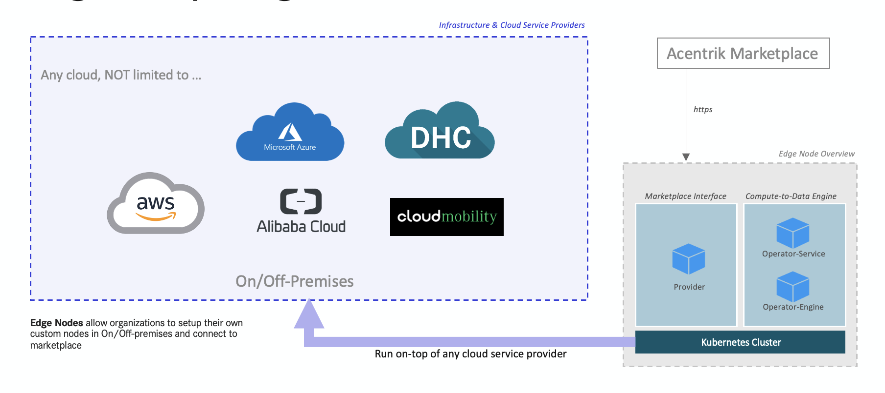

# Edge Node Guidelines and Setup Instructions

Edge Nodes (Providers) allow organizations to connect to the marketplace for secured connectivity to private data endpoints and run compute jobs on data within their control.

Edge Nodes can be hosted on any Kubernetes environment such as AWS, Azure, Alibaba Cloud, Cloud Mobility, DHC CaaS or within their own datacenters.



An edge node setup consists of the following components:

- **Provider** - An interface that is in charge of interacting with users and integrate the Compute-to-Data infrastructure into Acentrik.
- **Operator-Service** - Micro-service that is handling the compute requests.
- **Operator-Engine** - The computing systems where the compute jobs will be executed.

<br />

## Setting up Edge Computing Nodes on a Distributed Architecture

### Prerequisites

First, the following resources are required for a proper runtime environment setup:

1. Own-managed Storage (either one below), for secure storage of the compute output file.
   - AWS S3 bucket
   - Public IPFS gateway
   - Private IPFS gateway
   - Acentrik's private IPFS gateway\*
2. Own-managed PostgreSQL database (recommended stable version of Release 12.6)
3. An Ether wallet (MetaMask) account for the provider and Compute-to-Data (C2D) engine
4. An Ethereum RPC service provider account (such as Infura)
5. Own-managed Kubernetes environment
6. A DockerHub subscription account with a decent pull rate limit

\*Note: Relevant T&Cs will be applied for usage of Acentrik's Decentralized Storage. Dedicated API Client ID and Key will be distributed.

<br />

## Installation

Deploy the following helm chart with appropriate customized values. The download links for each helm charts will be provided.

|     | Helm Chart             | Recommended Namespace          | Right Aligned                                                                       |
| :-- | :--------------------- | :----------------------------- | ----------------------------------------------------------------------------------- |
| 1   | provider               | network specific, e.g. rinkeby | An Ethereum network-specific deployment object to serve an interface to Marketplace |
| 2   | operator-api           | ocean-operator                 | An Ethereum network-independent deployment object to manage all C2D requests        |
| 3   | ocean-compute-operator | ocean-compute                  | An Ethereum network-independent deployment object to execute the actual C2D jobs    |

Note: Modify the helm charts according on your own Kubernetes cluster setup when necessary. Alternatively you can deploy the standard Kubernetes yaml objects.

<br />

### Docker image registry

By default, all helm charts are predefined with standard DockerHub images.

Alternatively you can pull from the mirror images in Acentrik's Amazon Elastics Container Registry (Amazon ECR), or setup your own private registry if any.

**Acentrik Public Registry**

```
public.ecr.aws/j0e7f6c1
```

<br />

### Customize your Provider deployment

| Variable                    | Description                                                                                |
| --------------------------- | ------------------------------------------------------------------------------------------ |
| secret.infuraProjectId      | Ethereum RPC Project ID                                                                    |
| secret.providerPrivateKey\* | Private key of your provider wallet account, which used to encrypt the data asset endpoint |
| config.networkUrl           | Network name: rinkeby, mainnet, polygon                                                    |
| config.ipfsGateway          | Your IPFS Gateway if any                                                                   |
| config.operatorServiceUrl   | Your custom operator service endpoint URL                                                  |
| config.aquariusUrl\*\*      | Predefined Aquarius URL of a selected network                                              |

- Private Key
  - The secret half of your Address / public key
  - A string of 64 hexadecimal characters
  - Private key is unique to each wallet account
  - Example: afdfd9c3d2095ef696594f6cedcae59e72dcd697e2a7521b1578140422a4f890
  - As standard, the key will be stored as Kubernetes Secret. However, it is possible to integrate with an external secret provider depends on your distributed architecture infrastructure setup

\*\* Aquarius URL refer to https://aquarius.<network>.acentrik.io

**Steps**

```
cd <ocean-compute-operator chart directory>

helm upgrade provider ./ \
    --install \
    --namespace rinkeby \
    -f ./values-dev-rinkeby.yaml \
    --debug \
    --render-subchart-notes
```

<br />

### Customize your Operator Service deployment

| Variable                            | Description                                                                                                       |
| ----------------------------------- | ----------------------------------------------------------------------------------------------------------------- |
| secret.postgres.db                  | PostgreSQL operator database name                                                                                 |
| secret.postgres.user                | PostgreSQL operator database username                                                                             |
| secret.postgres.password            | PostgreSQL operator database password                                                                             |
| secret.postgres.host                | PostgreSQL operator database hostname                                                                             |
| secret.postgres.port                | PostgreSQL operator database port                                                                                 |
| config.operatorAddress              | Public address of your provider wallet account                                                                    |
| config.algoPodTimeout               | Allowed time (in seconds) for an algorithm to run. After timeout, the relevant execution pods will be terminated. |
| config.resource.inputVolumeSize     | Compute engine container input file volume size, value should include unit.                                       |
| config.resource.outputVolumeSize    | Compute engine container output file volume size, value should include unit.                                      |
| config.resource.adminLogsVolumeSize | Compute engine container log file volume size, value should include unit.                                         |
| config.resource.requestsCpu         | Compute engine container request minimum CPU, value should include unit.                                          |
| config.resource.requestsMemory      | Compute engine container request minimum memory, value should include unit.                                       |
| config.resource.limitsCpu           | Compute engine container request maximum CPU, value should include unit.                                          |
| config.resource.limitsMemory        | Compute engine container request maximum memory, value should include unit.                                       |

**Steps**

```
cd <operator-api chart directory>

helm upgrade operator-api ./ \
    --install \
    --namespace ocean-operator \
    -f ./values-dev.yaml \
    --debug \
    --render-subchart-notes
```

<br />

### Customize your Compute Engine deployment

| Variable                           | Description                                                                                                 |
| ---------------------------------- | ----------------------------------------------------------------------------------------------------------- |
| secret.postgres.db                 | PostgreSQL operator database name                                                                           |
| secret.postgres.user               | PostgreSQL operator database username                                                                       |
| secret.postgres.password           | PostgreSQL operator database password                                                                       |
| secret.postgres.host               | PostgreSQL operator database hostname                                                                       |
| secret.postgres.port               | PostgreSQL operator database port                                                                           |
| secret.postgres.operatorPrivateKey | Private key of your operator wallet account                                                                 |
| config.aws.enabled                 | Allowed AWS S3 bucket for compute data storage                                                              |
| secret.aws.accessKeyId             | AWS IAM user account access key ID to access S3 bucket                                                      |
| secret.aws.secretAccessKey         | AWS IAM user account access secret key to access S3 bucket                                                  |
| config.aws.bucket.output           | CS3 bucket to store compute output files                                                                    |
| config.aws.bucket.adminlogs        | S3 bucket to store compute log files                                                                        |
| config.ipfs.enabled                | Allowed IPFS for compute data storage. Note: By enable ipfs, it will always override AWS S3 storage option. |
| config.ipfs.output                 | IPFS API endpoint to store compute output files                                                             |
| config.ipfs.adminlogs              | IPFS API endpoint to store compute log files                                                                |
| config.ipfs.outputPrefix           | IPFS API endpoint for end-user to download compute output files                                             |
| config.ipfs.adminlogsPrefix        | IPFS API endpoint for end-user to download compute log files                                                |
| secret.ipfs.apiKey                 | IPFS API Key for authentication purpose (optional)                                                          |
| secret.ipfs.apiClient              | IPFS API Client ID for authentication purpose (optional)                                                    |

**Steps**

```
cd <ocean-compute-operator chart directory>

helm upgrade ocean-compute-operator ./ \
    --install \
    --namespace ocean-compute \
    -f ./values-dev.yaml \
    --debug \
    --render-subchart-notes
```

<br />

## Post-installation

### Initialize database

If your operator-api service is running on namespace ocean-operator with port 8050:

```

kubectl port-forward service/operator-api 8050:8050 -n ocean-operator
curl -X POST "http://localhost:8050/api/v1/operator/pgsqlinit" -H "accept: application/json"

```

### Update provider

Update Provider deployment by adding or updating the OPERATOR_SERVICE_URL environment variable:

```
OPERATOR_SERVICE_URL: http://operator-api.ocean-operator.svc.cluster.local:8050
```

<br />

## Connecting the Edge Nodes into the Marketplace via Provider Endpoint

The marketplace connects to the edge nodes via providers. Once the infrastructure setup is done, provide the public provider endpoint to Acentrik's Onboarding team for adding to trusted providers list.

Through Role-based access control, all users in the marketplace are tagged to their Company. Other than the Marketplace' default provider which is visible to all users, users within a particular Company should only be able to see and use their own custom providers when publishing data assets. A company can also have multiple custom providers based on their requirement.

<br />

## Guidelines for Edge Node Setup :

- By default, the private key file of the wallet provider is stored in Kubernetes Secret. However, you may also explore external alternative solutions like AWS Secrets Manager, Azure Key Vault, Cyberark, Conjur, etc.
- Provider endpoints MUST be publicly accessible.
- Store your data files securely using your own file server solutions such as S3 or Dropbox. Make sure your data files should only be reachable by your own provider and Compute-to-Data (C2D) engine.
- You are responsible for your own infrastructure security: adapt the own best practices of your Cloud Service providers or your on-premise infrastructure.
- You are responsible for upgrading the Provider version upon notification from Platform Team.
- Edge Nodes should only have Firewalls opened to only relevant Data endpoints and network to reduce the risk of connectivity to wider network.
