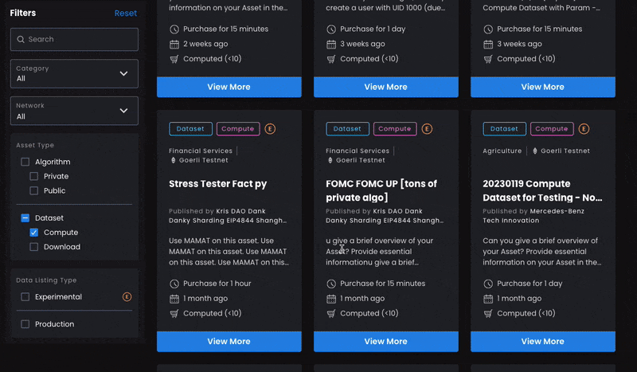

# Quickstart: Consume Compute-to-Data Flow

This describes the flow when running a Compute-to-Data job, focusing on Consumer's experience as a Data Consumer on Acentrik Data Marketplace

<br />

Here are the steps:

1.  Setup
2.  Approve Data Token
3.  Buys datatoken (Fixed-rate) / request datatoken from dispenser (Free)
4.  Approve Algorithm Token
5.  Buys Algorithm token (Fixed-rate) / request Algorithm token from dispenser (Free)
6.  Starts a compute job
7.  Monitors logs / output file

Let's go through each step. <b> There's two possible scenario for purchasing data token & Algorithm token, Fixed Rate and Free </b>

<br />

## 1. Setup

### Prerequisites

- ConsumerA's Wallets have Consumer roles
- Asset Information Json file
- Set config parameter

### Asset Information Json file

Create an asset_info.json file and filled up the asset details (Below are just sample asset, do not consume this asset)

```
{
  "network": "https://goerli.infura.io/v3/9aa3d95b3bc440fa88ea12eaa4456161",
  "networkName": "goerli",
  "networkID": 5,
  "aquariusUri": "https://v1.aquarius.sandbox.acentrik.io",
  "assetProviderUri": "https://v1.provider-ipfs.goerli.sandbox.acentrik.io",
  "assetDid": "did:op:f65f1608596933043fb7d5239bbb8ee5094fae030e1bb351d6a3178030636bdb",
  "assetTokenAddress": "0x8c7A2947a8Cb37acD02d9e60233462B0C69cC7f2",
  "assetOwnerAddress": "0x002D6F48A56E864b910Bc219B63440C6F6508Fe4",
  "assetBaseTokenAddress": "0x07865c6e87b9f70255377e024ace6630c1eaa37f",
  "algorithmProviderUri": "https://v1.provider-ipfs.goerli.sandbox.acentrik.io",
  "algorithmDid": "did:op:2c33782e902687e4f6647e86c7408b5bae8cbe0923f970ed3adc2ed6c84395d8",
  "algorithmTokenAddress": "0x127D5F22b7beee64263ED291065473365715547f",
  "algorithmOwnerAddress": "0x2E33C6014222A47585605F8379a1877eaaF0ec13",
  "algorithmBaseTokenAddress": "0x07865c6e87b9f70255377e024ace6630c1eaa37f"
}

```

<br />



<em>Head to specific Asset detail page, select the compatible algorithm, copy the asset details from Acentrik Developer Details section</em>

<br />

### Set config parameter

An Ocean instance will hold a config_dict that holds various config parameters. These parameters need to get set. This is set based on what's input to Ocean constructor:

1.  dict input: `Ocean({'METADATA_CACHE_URI':..})`
2.  use boilerplate from example config

#### Example

Here is an example for (1): dict input, filled from envvars

```python
from ocean_lib.example_config import get_config_dict
from ocean_lib.ocean.ocean import Ocean
config = get_config_dict("goerli")

config['METADATA_CACHE_URI'] = aquarius_uri
config['PROVIDER_URL'] = asset_provider_uri

ocean = Ocean(config)
```

<br />

In the Python console:

```python
from web3.main import Web3
import json

# Read asset_info.json file
asset_info = open('asset_info.json')
data_asset_info = json.load(asset_info)
asset_info.close()

aquarius_uri = data_asset_info["aquariusUri"]
DATA_did = data_asset_info["assetDid"]
data_token_address =  data_asset_info["assetTokenAddress"]
data_token_owner_address = data_asset_info["assetOwnerAddress"]
data_token_ProviderUri = data_asset_info["assetProviderUri"]
ALG_did = data_asset_info["algorithmDid"]
algo_token_address = data_asset_info["algorithmTokenAddress"]
algo_token_owner_address = data_asset_info["algorithmOwnerAddress"]
algo_token_ProviderUri = data_asset_info["algorithmProviderUri"]


# Create Ocean instance
from ocean_lib.web3_internal.utils import connect_to_network
connect_to_network("goerli")
import os
from ocean_lib.example_config import get_config_dict
from ocean_lib.ocean.ocean import Ocean
config = get_config_dict("goerli")

# Set config parameter
config['METADATA_CACHE_URI'] = aquarius_uri
config['PROVIDER_URL'] = data_token_ProviderUri

ocean = Ocean(config)
from brownie.network import accounts
from ocean_lib.models.datatoken2 import Datatoken2
from ocean_lib.models.datatoken_base import DatatokenBase, TokenFeeInfo
print(f"config.metadata_cache_uri = {config['METADATA_CACHE_URI']}")
print(f"config.provider_url = {config['PROVIDER_URL']}")


from brownie.network.gas.strategies import GasNowStrategy
from brownie import network
gas_strategy = GasNowStrategy("fast")
network.gas_limit("auto")
network.gas_price("auto")
```

<br />

## 2. ConsumerA Approve Data Token

### Scenario A - Fixed-rate aka Premium

In the Python console:

```python
USDC_token = DatatokenBase(config, Web3.toChecksumAddress("0x07865c6E87B9F70255377e024ace6630C1Eaa37F"))
asset_erc20_enterprise_token = Datatoken2(config, Web3.toChecksumAddress(data_token_address))
algo_erc20_enterprise_token = Datatoken2(config, Web3.toChecksumAddress(algo_token_address))
consumer_private_key = os.getenv('TEST_PRIVATE_KEY1')
consumer_A_wallet = accounts.add(consumer_private_key)
print(f"================")
print(f"consumer_A_wallet.address = '{consumer_A_wallet.address}'")

nft_factory = ocean.data_nft_factory
DATA_asset = ocean.assets.resolve(DATA_did)
ALGO_asset = ocean.assets.resolve(ALG_did)
# Operate on updated and indexed assets
compute_service = DATA_asset.services[0]
algo_service = ALGO_asset.services[0]
environments = ocean.compute.get_c2d_environments(data_token_ProviderUri)
from datetime import datetime, timedelta
from ocean_lib.models.compute_input import ComputeInput
DATA_compute_input = ComputeInput(DATA_asset, compute_service)
ALGO_compute_input = ComputeInput(ALGO_asset, algo_service)

# Approve tokens for consumer_A
USDC_token.approve(asset_erc20_enterprise_token.address,  Web3.toWei(1000, "ether"), {"from": consumer_A_wallet})
asset_erc20_enterprise_token.approve(asset_erc20_enterprise_token.address,  Web3.toWei(1000, "ether"), {"from": consumer_A_wallet})
algo_erc20_enterprise_token.approve(algo_erc20_enterprise_token.address, Web3.toWei(1000,  "ether"), {"from": consumer_A_wallet})
```

### Scenario B - Free

In the Python console:

```python
asset_erc20_enterprise_token = Datatoken2(config, Web3.toChecksumAddress(data_token_address))
algo_erc20_enterprise_token = Datatoken2(config, Web3.toChecksumAddress(algo_token_address))
consumer_private_key = os.getenv('TEST_PRIVATE_KEY1')
consumer_A_wallet = accounts.add(consumer_private_key)
print(f"================")
print(f"consumer_A_wallet.address = '{consumer_A_wallet.address}'")

nft_factory = ocean.data_nft_factory
DATA_asset = ocean.assets.resolve(DATA_did)
ALGO_asset = ocean.assets.resolve(ALG_did)
# Operate on updated and indexed assets
compute_service = DATA_asset.services[0]
algo_service = ALGO_asset.services[0]
environments = ocean.compute.get_c2d_environments(data_token_ProviderUri)
from datetime import datetime, timedelta
from ocean_lib.models.compute_input import ComputeInput
DATA_compute_input = ComputeInput(DATA_asset, compute_service)
ALGO_compute_input = ComputeInput(ALGO_asset, algo_service)

# Approve tokens for consumer_A
asset_erc20_enterprise_token.approve(asset_erc20_enterprise_token.address,  Web3.toWei(1000, "ether"), {"from": consumer_A_wallet})
algo_erc20_enterprise_token.approve(algo_erc20_enterprise_token.address, Web3.toWei(1000,  "ether"), {"from": consumer_A_wallet})
```

<br />

## 3. ConsumerA buys datatoken (Fixed-rate) / request datatoken from dispenser (Free)

Get provider fees info for algorithm and compute asset

```python
fees_response = ocean.retrieve_provider_fees_for_compute(
            datasets=[DATA_compute_input],
            algorithm_data=ALGO_compute_input,
            consumer_address=environments[1]["consumerAddress"],
            compute_environment=environments[1]["id"],
            valid_until=int((datetime.utcnow() + timedelta(days=1)).timestamp()),
)
```

### Scenario A - Fixed-rate aka Premium

In the same python console (Fixed Pricing Asset):

```python
# get asset exchange id
asset_exchange_addresses_and_ids = nft_factory.search_exchange_by_datatoken(
    fixed_rate_exchange=ocean.fixed_rate_exchange,
    datatoken=data_token_address,
    exchange_owner=data_token_owner_address
)
assert (
    asset_exchange_addresses_and_ids
), f"No exchanges found. datatoken_address = {data_token_address}, exchange_owner = {data_token_owner_address}."
print(asset_exchange_addresses_and_ids)

provider_fees = fees_response["datasets"][0]["providerFee"]

asset_exchange_id = asset_exchange_addresses_and_ids[0][1]
from ocean_lib.models.fixed_rate_exchange import FixedRateExchange, OneExchange
fre_exchange = FixedRateExchange(config, ocean.fixed_rate_exchange.contract.address)
one_exchange = OneExchange(fre_exchange, asset_exchange_id)
consume_market_fees=TokenFeeInfo(
            address=consumer_A_wallet.address,
            token="0x07865c6E87B9F70255377e024ace6630C1Eaa37F",
            amount=0,
)
tx = asset_erc20_enterprise_token.buy_DT_and_order(
        provider_fees=provider_fees,
        exchange=one_exchange,
        tx_dict={"from": consumer_A_wallet},
        service_index=0,
        consume_market_fees=consume_market_fees,
        max_base_token_amount= Web3.toWei(10, "ether"),
        consume_market_swap_fee_amount=Web3.toWei(0.001, "ether"),   # 1e15 => 0.1%
        consume_market_swap_fee_address=consumer_A_wallet.address
    )
# set transaction id
DATA_compute_input.transfer_tx_id = tx.txid
```

<br />

### Scenario B - Free

In the same python console (Free Pricing Asset):

```python
provider_fees = fees_response["datasets"][0]["providerFee"]

consume_market_fees=TokenFeeInfo(
            address=consumer_A_wallet.address,
            token="0x07865c6E87B9F70255377e024ace6630C1Eaa37F",
            amount=0,
)
tx = asset_erc20_enterprise_token.dispense_and_order(
    consumer=environments[0]["consumerAddress"],
    provider_fees=provider_fees,
    tx_dict={"from": consumer_A_wallet},
    consume_market_fees=consume_market_fees,
    service_index=0,
)
# set transaction id
DATA_compute_input.transfer_tx_id = tx.txid
```

<br />

## 4. ConsumerA Approve Algorithm Token

In the Python console:

```python
algo_erc20_enterprise_token.approve(algo_erc20_enterprise_token.address, Web3.toWei(1000,  "ether"), {"from": consumer_A_wallet})
```

<br />

## 5. ConsumerA buys Algorithm token (Fixed-rate) / request Algorithm token from dispenser (Free)

### Scenario A - Fixed-rate aka Premium

In the same python console (Fixed Pricing Asset):

```python
# get asset exchange id
algo_erc20_enterprise_token.approve(algo_erc20_enterprise_token.address, Web3.toWei(1000,  "ether"), {"from": consumer_A_wallet})
algo_exchange_addresses_and_ids = nft_factory.search_exchange_by_datatoken(
    fixed_rate_exchange=ocean.fixed_rate_exchange,
    datatoken=algo_token_address,
    exchange_owner=algo_token_owner_address
)
assert (
    algo_exchange_addresses_and_ids
), f"No exchanges found. datatoken_address = {algo_token_address}, exchange_owner = {algo_token_owner_address}."
print(algo_exchange_addresses_and_ids)
algo_exchange_id = algo_exchange_addresses_and_ids[0][1]

algo_provider_fees = fees_response["algorithm"]["providerFee"]

algo_one_exchange = OneExchange(fre_exchange, algo_exchange_id)
tx_algo = algo_erc20_enterprise_token.buy_DT_and_order(
        provider_fees=algo_provider_fees,
        exchange=algo_one_exchange,
        tx_dict={"from": consumer_A_wallet},
        service_index=0,
        consume_market_fees=consume_market_fees,
        max_base_token_amount= Web3.toWei(10, "ether"),
        consume_market_swap_fee_amount=Web3.toWei(0.001, "ether"),   # 1e15 => 0.1%
        consume_market_swap_fee_address=consumer_A_wallet.address
)
# set transaction id
ALGO_compute_input.transfer_tx_id = tx_algo.txid
```

<br />

### Scenario B - Free

In the same python console (Free Pricing Asset):

```python
algo_provider_fees = fees_response["algorithm"]["providerFee"]
tx_algo = algo_erc20_enterprise_token.dispense_and_order(
    consumer=environments[0]["consumerAddress"],
    provider_fees=algo_provider_fees,
    tx_dict={"from": consumer_A_wallet},
    consume_market_fees=consume_market_fees,
    service_index=0,
)
# set transaction id
ALGO_compute_input.transfer_tx_id = tx_algo.txid
```

<br />

## 6. ConsumerA starts a compute job

### ⚠️ Disclaimer

Please reuse a transaction ID if its not expired, so you wont be paying for the transaction fee again.
You can get your previous transaction on a dataToken using the method `erc20_enterprise_token.get_start_order_logs()` & just consume the asset using the transaction id, it will check if the asset is still consumable.

In the same python console:

```python
# run job
job_id = ocean.compute.start(
    consumer_wallet=consumer_A_wallet,
    dataset=DATA_compute_input,
    compute_environment=environments[1]["id"],
    algorithm=ALGO_compute_input
)
print(f"Started compute job with id: {job_id}")
```

<br />

## 7. ConsumerA monitors logs / algorithm output

In the same python console:

```python
# ConsumerA check job status
# Wait until job is done
import time
from decimal import Decimal
succeeded = False
for _ in range(0, 200):
    status = ocean.compute.status(DATA_asset, compute_service, job_id, consumer_A_wallet)
    print("status================")
    print(status)
    if status.get("dateFinished") and Decimal(status["dateFinished"]) > 0:
        succeeded = True
        break
    time.sleep(5)

# ============================================================================================
# ConsumerA get result (After job finished)

# 0 index, means we retrieve the results from the first dataset index
result_file = ocean.compute.compute_job_result_logs(
    DATA_asset, compute_service, job_id, consumer_A_wallet
)[0]
print(result_file)
```
