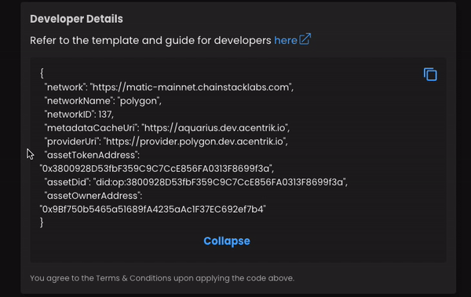

# Quickstart: Consume Compute-to-Data Flow

This describes the flow when running a Compute-to-Data job, focusing on ConsumerA's experience as a Data Consumer on Acentrik Data Marketplace

<br />

## Disclaimer

The Current Compute-to-Date Job are still on work in progress.

<br />

Here are the steps:

1.  Setup
2.  ConsumerA Approve Data Token
3.  ConsumerA buys datatoken (Fixed-rate) / request datatoken from dispenser (Free)
4.  ConsumerA Approve Algorithm Token
5.  ConsumerA buys Algorithm token (Fixed-rate) / request Algorithm token from dispenser (Free)
6.  ConsumerA starts a compute job
7.  ConsumerA monitors logs / output file

Let's go through each step.

<br />

## 1. Setup

### Prerequisites

- ConsumerA's Wallets have Consumer roles
- Asset Information Json file

Create an asset_info.json file and filled up the asset details

```
{
  "network": "https://matic-mainnet.chainstacklabs.com",
  "networkName": "polygon",
  "networkID": 137,
  "metadataCacheUri": "https://aquarius.acentrik.io",
  "providerUri": "https://provider.polygon.acentrik.io",
  "assetTokenAddress": "0x8748ef04C53974821F1174749c4B7A9486dbad19",
  "assetDid": "did:op:8748ef04C53974821F1174749c4B7A9486dbad19",
  "assetOwnerAddress": "0x2eCA8718b2fCaf0CF9E150ad4B44EE8c54473D2C",
  "algorithmTokenAddress": "0xe75a2Ca6D9b184d9807A1A1B5AE9BE57e9c897cD",
  "algorithmDid": "did:op:e75a2Ca6D9b184d9807A1A1B5AE9BE57e9c897cD",
  "algorithmOwnerAddress": "0x500DB43EE6966e6213BA58EAF152dA593EB7432e"
}
```

<br />



<em>Copy the asset details from Acentrik developer details section</em>

<br />

In the Python console:

```python
#create ocean instance
from ocean_lib.config import Config
from ocean_lib.ocean.ocean import Ocean
config = Config('config.ini')
ocean = Ocean(config)
from ocean_lib.models.erc20_enterprise import ERC20Enterprise
import json

print(f"ocean.exchange._exchange_address = '{ocean.exchange._exchange_address}'")
print(f"config.network_url = '{config.network_url}'")
print(f"config.block_confirmations = {config.block_confirmations.value}")
print(f"config.metadata_cache_uri = '{config.metadata_cache_uri}'")
print(f"config.provider_url = '{config.provider_url}'")

from ocean_lib.web3_internal.currency import from_wei, to_wei
import os
from ocean_lib.web3_internal.wallet import Wallet

# Read asset_info.json file
asset_info = open('asset_info.json')
data_asset_info = json.load(asset_info)
asset_info.close()

DATA_did = data_asset_info["assetDid"]
data_token_address =  data_asset_info["assetTokenAddress"]
data_token_owner_address = data_asset_info["assetOwnerAddress"]

ALG_did = data_asset_info["algorithmDid"]
algo_token_address = data_asset_info["algorithmTokenAddress"]
algo_token_owner_address = data_asset_info["algorithmOwnerAddress"]
base_token_address = data_asset_info["baseTokenAddress"]

usdc_token = ocean.get_datatoken(ocean.web3.toChecksumAddress(base_token_address))

asset_erc20_enterprise_token = ERC20Enterprise(ocean.web3, ocean.web3.toChecksumAddress(data_token_address))

algo_erc20_enterprise_token = ERC20Enterprise(ocean.web3, ocean.web3.toChecksumAddress(algo_token_address))

consumer_private_key = os.getenv('TEST_PRIVATE_KEY2')
consumer_A_wallet = Wallet(ocean.web3, consumer_private_key, config.block_confirmations,  config.transaction_timeout)
print(f"consumer_A_wallet.address = '{consumer_A_wallet.address}'")

# Convenience variables
DATA_asset = ocean.assets.resolve(DATA_did)
ALGO_asset = ocean.assets.resolve(ALG_did)

# Operate on updated and indexed assets
compute_service = DATA_asset.services[0]
algo_service = ALGO_asset.services[0]

environments = ocean.compute.get_c2d_environments(compute_service.service_endpoint)

from datetime import datetime, timedelta
from ocean_lib.models.compute_input import ComputeInput

DATA_compute_input = ComputeInput(DATA_asset, compute_service)
ALGO_compute_input = ComputeInput(ALGO_asset, algo_service)
```

<br />

## 2. ConsumerA Approve Data Token

In the Python console:

```python
usdc_token.approve(asset_erc20_enterprise_token.address, ocean.to_wei(100), consumer_A_wallet)

asset_erc20_enterprise_token.approve(asset_erc20_enterprise_token.address, ocean.to_wei(100), consumer_A_wallet)
```

<br />

## 3. ConsumerA buys datatoken (Fixed-rate) / request datatoken from dispenser (Free)

Get provider fees info for algorithm and compute asset

```python
fees_response = ocean.retrieve_provider_fees_for_compute(
            datasets=[DATA_compute_input],
            algorithm_data=ALGO_compute_input,
            consumer_address=environments[0]["consumerAddress"],
            compute_environment=environments[0]["id"],
            valid_until=int((datetime.utcnow() + timedelta(days=1)).timestamp()),
)
```

### If the Asset is Fixed Price

In the same python console (Fixed Pricing Asset):

```python
# get asset exchange id
asset_exchange_addresses_and_ids = ocean.get_nft_factory().search_exchange_by_datatoken(ocean.fixed_rate_exchange, asset_erc20_enterprise_token.address, exchange_owner=data_token_owner_address)
assert (
    asset_exchange_addresses_and_ids
), f"No exchanges found. datatoken_address = {data_token_address}, exchange_owner = {data_token_owner_address}."
print(asset_exchange_addresses_and_ids)

asset_exchange_address = asset_exchange_addresses_and_ids[0][0]
asset_exchange_id = asset_exchange_addresses_and_ids[0][1]

provider_fees = fees_response["datasets"][0]["providerFee"]

tx = asset_erc20_enterprise_token.buy_from_fre_and_order(
        consumer=environments[0]["consumerAddress"],
        service_index=0,
        provider_fee_address= provider_fees["providerFeeAddress"],
        provider_fee_token=provider_fees["providerFeeToken"],
        provider_fee_amount=int(provider_fees["providerFeeAmount"]),
        v=provider_fees["v"],
        r=provider_fees["r"],
        s=provider_fees["s"],
        valid_until=provider_fees["validUntil"],
        provider_data=provider_fees["providerData"],
        consume_market_order_fee_address=consumer_A_wallet.address,
        consume_market_order_fee_token=asset_erc20_enterprise_token.address,
        consume_market_order_fee_amount=0,
        exchange_contract=ocean.fixed_rate_exchange.address,
        exchange_id=asset_exchange_id,
        max_base_token_amount=to_wei(10),
        consume_market_swap_fee_amount=to_wei("0.001"),  # 1e15 => 0.1%
        consume_market_swap_fee_address=consumer_A_wallet.address,
        from_wallet=consumer_A_wallet,
    )

# set transaction id
DATA_compute_input.transfer_tx_id = tx
```

<br />

### If the Asset is Free Price

In the same python console (Free Pricing Asset):

```python
provider_fees = fees_response["datasets"][0]["providerFee"]

tx = asset_erc20_enterprise_token.buy_from_dispenser_and_order(
        consumer=environments[0]["consumerAddress"],
        service_index=0,
        provider_fee_address=provider_fees["providerFeeAddress"],
        provider_fee_token=provider_fees["providerFeeToken"],
        provider_fee_amount=int(provider_fees["providerFeeAmount"]),
        v=provider_fees["v"],
        r=provider_fees["r"],
        s=provider_fees["s"],
        valid_until=provider_fees["validUntil"],
        provider_data=provider_fees["providerData"],
        consume_market_order_fee_address=consumer_A_wallet.address,
        consume_market_order_fee_token=asset_erc20_enterprise_token.address,
        consume_market_order_fee_amount=0,
        dispenser_address=ocean.dispenser.address,
        from_wallet=consumer_A_wallet,
    )
# set transaction id
DATA_compute_input.transfer_tx_id = tx
```

<br />

## 4. ConsumerA Approve Algorithm Token

In the Python console:

```python
usdc_token.approve(algo_erc20_enterprise_token.address, ocean.to_wei(100), consumer_A_wallet)

algo_erc20_enterprise_token.approve(algo_erc20_enterprise_token.address, ocean.to_wei(100), consumer_A_wallet)
```

<br />

## 5. ConsumerA buys Algorithm token (Fixed-rate) / request Algorithm token from dispenser (Free)

### If the Asset is Fixed Price

In the same python console (Fixed Pricing Asset):

```python
# get asset exchange id
algo_exchange_addresses_and_ids = ocean.get_nft_factory().search_exchange_by_datatoken(ocean.fixed_rate_exchange, algo_erc20_enterprise_token.address, exchange_owner=algo_token_owner_address)
assert (
    algo_exchange_addresses_and_ids
), f"No exchanges found. datatoken_address = {algo_erc20_enterprise_token.address}, exchange_owner = {algo_token_owner_address}."
print(algo_exchange_addresses_and_ids)

algo_exchange_address = algo_exchange_addresses_and_ids[0][0]
algo_exchange_id = algo_exchange_addresses_and_ids[0][1]

algo_provider_fees = fees_response["algorithm"]["providerFee"]

tx_algo = algo_erc20_enterprise_token.buy_from_fre_and_order(
        consumer=environments[0]["consumerAddress"],
        service_index=0,
        provider_fee_address= algo_provider_fees["providerFeeAddress"],
        provider_fee_token=algo_provider_fees["providerFeeToken"],
        provider_fee_amount=int(algo_provider_fees["providerFeeAmount"]),
        v=algo_provider_fees["v"],
        r=algo_provider_fees["r"],
        s=algo_provider_fees["s"],
        valid_until=algo_provider_fees["validUntil"],
        provider_data=algo_provider_fees["providerData"],
        consume_market_order_fee_address=consumer_A_wallet.address,
        consume_market_order_fee_token=algo_erc20_enterprise_token.address,
        consume_market_order_fee_amount=0,
        exchange_contract=ocean.fixed_rate_exchange.address,

        exchange_id=algo_exchange_id,
        max_base_token_amount=to_wei(10),
        consume_market_swap_fee_amount=to_wei("0.001"),  # 1e15 => 0.1%
        consume_market_swap_fee_address=consumer_A_wallet.address,
        from_wallet=consumer_A_wallet,
    )

# set transaction id
ALGO_compute_input.transfer_tx_id = tx_algo
```

<br />

### If the Asset is Free Price

In the same python console (Free Pricing Asset):

```python
algo_provider_fees = fees_response["algorithm"]["providerFee"]

tx_algo = algo_erc20_enterprise_token.buy_from_dispenser_and_order(
        consumer=environments[0]["consumerAddress"],
        service_index=0,
        provider_fee_address= algo_provider_fees["providerFeeAddress"],
        provider_fee_token=algo_provider_fees["providerFeeToken"],
        provider_fee_amount=int(algo_provider_fees["providerFeeAmount"]),
        v=algo_provider_fees["v"],
        r=algo_provider_fees["r"],
        s=algo_provider_fees["s"],
        valid_until=algo_provider_fees["validUntil"],
        provider_data=algo_provider_fees["providerData"],
        consume_market_order_fee_address=consumer_A_wallet.address,
        consume_market_order_fee_token=algo_erc20_enterprise_token.address,
        consume_market_order_fee_amount=0,
        dispenser_address=ocean.dispenser.address,
        from_wallet=consumer_A_wallet,
    )

# set transaction id
ALGO_compute_input.transfer_tx_id = tx_algo
```

<br />

## 6. ConsumerA starts a compute job

In the same python console:

```python
# run job
job_id = ocean.compute.start(
    consumer_wallet=consumer_A_wallet,
    dataset=DATA_compute_input,
    compute_environment=environments[0]["id"],
    algorithm=ALGO_compute_input
)
print(f"Started compute job with id: {job_id}")
```

<br />

## 7. ConsumerA monitors logs / algorithm output

In the same python console:

```python
# ConsumerA check job status
# Wait until job is done
import time
from decimal import Decimal
succeeded = False
for _ in range(0, 200):
    status = ocean.compute.status(DATA_asset, compute_service, job_id, consumer_A_wallet)
    print("status================")
    print(status)
    if status.get("dateFinished") and Decimal(status["dateFinished"]) > 0:
        succeeded = True
        break
    time.sleep(5)

# ============================================================================================
# ConsumerA get result (After job finished)

# 0 index, means we retrieve the results from the first dataset index
result_file = ocean.compute.compute_job_result_logs(
    DATA_asset, compute_service, job_id, consumer_A_wallet
)[0]
print(result_file)
```
